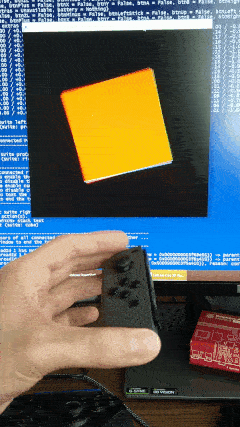

# switch

`switch` is a library for interacting with Nintendo Switch controllers, written in Haskell. It allows your application to detect controllers via Bluetooth, connect to them, read input (e.g., buttons, sensors) from them and sending commands (e.g., rumble) to them. Notable features of this library are:

* Supports all popular controller types (left Joy-Con, right Joy-Con, Pro Controller).
* Supports controller input: read button states, analog stick directions and battery information.
* Supports controller output: send rumble commands, set player lights and configure the home light.
* Supports position tracking of a controller using its accelerometer and gyroscope.
* Provides a type-safe interface for controller interaction (e.g., trying to configure the home light of a controller which has no home light results in a compile error).

The communication protocol of the controllers is based on [existing efforts of the reverse engineering community](https://github.com/dekuNukem/Nintendo_Switch_Reverse_Engineering/). The documentation of the library can be found on [Hackage](https://hackage.haskell.org/package/switch).

## Usage

1. Press and hold the SYNC button on your Nintendo Switch controller for a few seconds. It is the small black button on the side (Joy-Con) or top (Pro Controller) of the controller.
2. Scan for Bluetooth devices on your computer. Depending on your controller, you should detect a device named *Joy-Con (L)*, *Joy-Con (R)* or *Pro Controller*. Connect to it.
3. Talk to the controller by developing and running an application that uses the `switch` library on your computer, or try one of the provided [examples](/test).

## Compatibility

This library *should* work with Windows, Linux and macOS, but it was primarily tested under Windows 10.

## Limitations and Remarks

The following features are not implemented yet:

* Interacting with the NFC sensor of the right Joy-Con.
* Interacting with the IR camera of the right Joy-Con.